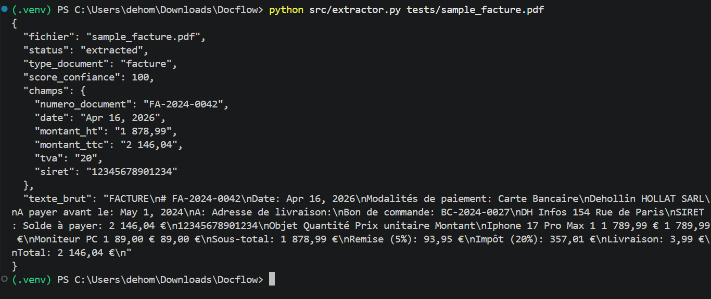
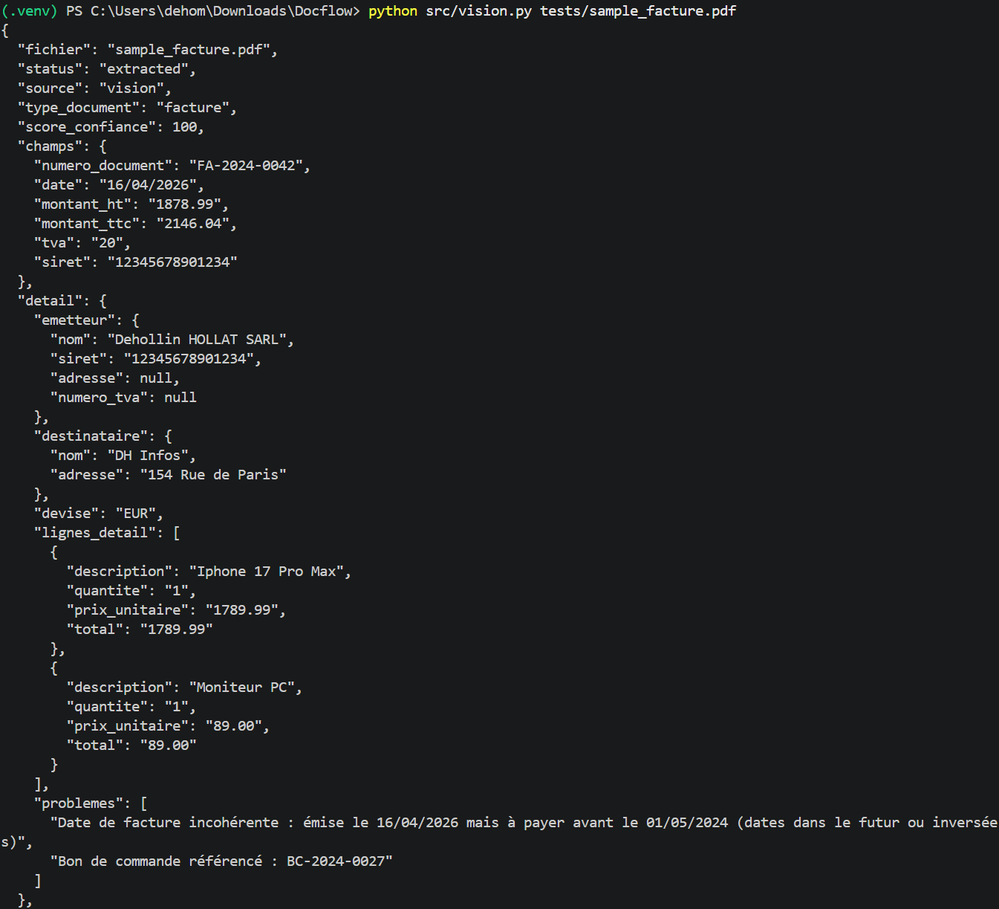
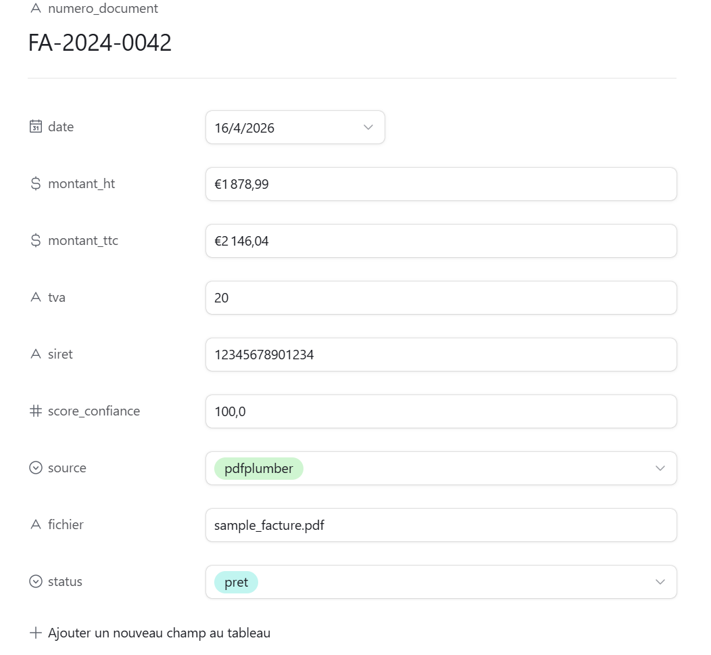
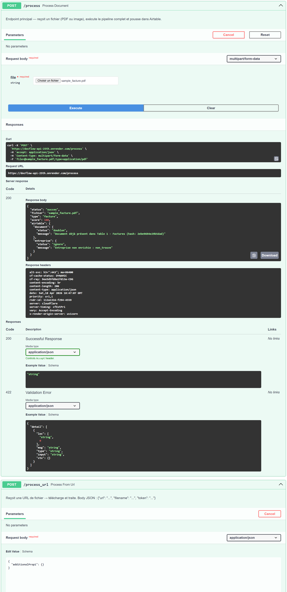
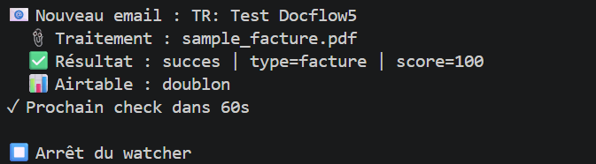

# 📄 DocFlow — Méthodologie

**Auteur :** Déhollin HOLLAT, Chef de Projet Data IA 
> Pipeline intelligent de traitement automatique de documents entrants (factures, bons de commande, documents scannés) — de la boîte mail à Airtable, sans intervention humaine.

---

## 📋 Sommaire

- [Pourquoi ce projet ?](#pourquoi-ce-projet)
- [Vue d'ensemble du pipeline](#vue-densemble-du-pipeline)
- [Phase 1 — Extraction PDF natif](#phase-1--extraction-pdf-natif)
- [Phase 2 — Extraction par vision IA](#phase-2--extraction-par-vision-ia)
- [Phase 3 — Normalisation et validation](#phase-3--normalisation-et-validation)
- [Phase 4 — Enrichissement API](#phase-4--enrichissement-api)
- [Phase 5 — Push Airtable et déduplication](#phase-5--push-airtable-et-déduplication)
- [Phase 6 — API FastAPI et surveillance Gmail](#phase-6--api-fastapi-et-surveillance-gmail)
- [Résultats et performances](#résultats-et-performances)
- [Limites et évolutions](#limites-et-évolutions)
- [Lexique](#lexique)

---

## Pourquoi ce projet ?

Dans beaucoup d'entreprises, le traitement des documents entrants (factures fournisseurs, bons de commande, contrats) est encore **manuel** : une personne ouvre les emails, télécharge les pièces jointes, recopie les données dans un tableur ou un ERP.

Ce processus est lent, sujet aux erreurs et ne passe pas à l'échelle.

**DocFlow automatise l'intégralité de ce flux** : dès qu'un email avec pièce jointe arrive dans la boîte mail surveillée, le pipeline se déclenche automatiquement, extrait les données clés, les valide et les pousse dans Airtable — en moins de 30 secondes, sans qu'un humain intervienne.

---

## Vue d'ensemble du pipeline

<!-- Image : schéma d'architecture globale du pipeline -->


```
📧 Email reçu (Gmail)
│
▼
🔍 gmail_watcher.py
Surveillance toutes les 60s
Filtre : pièces jointes uniquement
│
▼
🌐 API FastAPI (Render)
POST /process_b64
│
├─── PDF natif ──► extractor.py (pdfplumber)
│
└─── PDF scanné / Image ──► vision.py (Claude API)
│
▼
⚙️ normalizer.py
Format uniforme + score de confiance + hash
│
▼
🔎 enricher.py
API entreprise.data.gouv.fr (SIRET → infos légales)
│
▼
📊 airtable_client.py
Vérification doublon → Push Airtable
│
▼
✅ Document dans Airtable
```

---

## Phase 1 — Extraction PDF natif

**Fichier :** `src/extractor.py`

Quand un PDF est reçu, la première question est : contient-il du texte lisible par une machine, ou est-ce une image scannée ?

Si le PDF contient du texte natif (créé avec Word, un logiciel de facturation, etc.), on utilise **pdfplumber** — une bibliothèque Python qui lit la structure du document et extrait le texte en respectant la mise en page.

On cherche ensuite des **patterns** dans ce texte pour identifier les champs clés :

| Champ | Exemple détecté |
|---|---|
| Numéro de document | FA-2024-0042 |
| Date | Apr 16, 2026 → 2026-04-16 |
| Montant HT | Sous-total: 1 878,99 € |
| Montant TTC | Total: 2 146,04 € |
| TVA | Impôt (20%) |
| SIRET | 12345678901234 |

**Pourquoi pdfplumber plutôt qu'un autre outil ?** pdfplumber respecte la disposition spatiale du texte — il reconstitue les colonnes et tableaux correctement, là où d'autres bibliothèques concatènent le texte dans le désordre.

Si aucun texte n'est détecté → le document est considéré comme scanné et délégué à la Phase 2.

<!-- Image : exemple de résultat JSON extractor.py dans le terminal -->


---

## Phase 2 — Extraction par vision IA

**Fichier :** `src/vision.py`

Pour les PDF scannés et les photos de documents, le texte n'est pas lisible directement. On envoie le fichier à **Claude API** (modèle claude-haiku) qui analyse l'image et retourne les données structurées en JSON.

Le prompt est construit pour forcer une réponse JSON stricte avec tous les champs attendus. Claude gère aussi les cas complexes : document mal orienté, qualité faible, texte partiellement illisible.

Un champ `problemes_detectes` liste les anomalies repérées (incohérence de dates, frais non détaillés, etc.) — utile pour l'audit.

| Type de document | Méthode utilisée |
|---|---|
| PDF avec texte natif | pdfplumber (gratuit, déterministe) |
| PDF scanné | Claude API Vision |
| Photo (JPG, PNG…) | Claude API Vision |

<!-- Image : exemple de résultat JSON vision.py sur une image -->


---

## Phase 3 — Normalisation et validation

**Fichier :** `src/normalizer.py`

Quelle que soit la source (pdfplumber ou Claude Vision), les données brutes sont normalisées en un format uniforme :

- Les montants sont convertis en float (`"1 878,99 €"` → `1878.99`)
- Les dates sont converties en ISO 8601 (`"Apr 16, 2026"` → `"2026-04-16"`)
- Le SIRET est nettoyé (espaces supprimés, longueur vérifiée)

### Score de confiance

Chaque document reçoit un **score de confiance** entre 0 et 100% :

| Champ | Poids |
|---|---|
| Numéro de document | x2 (obligatoire) |
| Date | x2 (obligatoire) |
| Montant TTC | x2 (obligatoire) |
| Montant HT | x1 (secondaire) |
| TVA | x1 (secondaire) |
| SIRET | x1 (secondaire) |

**En dessous de 70%** → le document est mis en file d'attente pour revue manuelle. Au-dessus → traitement automatique validé.

### Déduplication par hash

Un **hash unique** est généré pour chaque document à partir de son numéro, son montant TTC et sa date. Si ce hash existe déjà dans Airtable, le document est rejeté comme doublon — évitant les doublons de saisie.

---

## Phase 4 — Enrichissement API

**Fichier :** `src/enricher.py`

Une fois le SIRET extrait, on interroge l'API publique `entreprise.data.gouv.fr` pour récupérer les informations légales de l'entreprise émettrice :

| Information | Source |
|---|---|
| Nom légal | API Sirene |
| Forme juridique (SARL, SAS…) | API Sirene |
| Adresse du siège | API Sirene |
| Statut (Actif / Cessé) | API Sirene |

Si le SIRET est fictif ou introuvable, le pipeline ne plante pas — il documente l'échec avec un statut `non_trouve` et continue.

---

## Phase 5 — Push Airtable et déduplication

**Fichier :** `src/airtable_client.py`

Le document enrichi est poussé dans la bonne table Airtable selon son type :

| Type détecté | Table Airtable |
|---|---|
| facture | Table 1 - Factures |
| bon_de_commande | Table 2 - Bons_de_commande |
| Entreprise (si SIRET trouvé) | Table 3 - Entreprises |

Avant chaque insertion, le hash est vérifié — si le document existe déjà, il est rejeté avec notification.

<!-- Image : capture d'écran Airtable avec les données insérées -->


---

## Phase 6 — API FastAPI et surveillance Gmail

**Fichiers :** `main.py`, `gmail_watcher.py`

### API FastAPI

Le pipeline Python est exposé via une **API FastAPI** déployée sur Render. Elle propose trois endpoints :

| Endpoint | Usage |
|---|---|
| `GET /` | Health check |
| `POST /process` | Upload direct d'un fichier |
| `POST /process_b64` | Fichier encodé en base64 (utilisé par gmail_watcher) |
| `POST /process_url` | Fichier via URL publique |

<!-- Image : capture Swagger FastAPI -->


### Surveillance Gmail

`gmail_watcher.py` tourne en local et surveille la boîte Gmail toutes les 60 secondes. Dès qu'un email non lu avec pièce jointe est détecté :

1. La pièce jointe est téléchargée via l'API Gmail
2. Encodée en base64 et envoyée à l'API FastAPI
3. L'email est marqué comme lu
4. L'ID du message est sauvegardé pour éviter le retraitement

<!-- Image : terminal gmail_watcher.py en action -->


---

## Résultats et performances

Tests réalisés sur 4 documents différents :

| Document | Source | Score | Statut |
|---|---|---|---|
| Facture PDF native | pdfplumber | 100% ✅ | Extrait |
| Facture PDF scannée | Claude Vision | 100% ✅ | Extrait |
| Bon de commande artisan (image) | Claude Vision | 100% ✅ | Extrait |
| Facture atelier poterie (image) | Claude Vision | 80% ⚠️ | Extrait (SIRET absent) |

---

## Difficultés rencontrées

### Intégration n8n — transmission des fichiers binaires

L'orchestration du pipeline via **n8n** (outil no-code d'automatisation) a posé un problème technique majeur : n8n ne permet pas de transmettre facilement des fichiers binaires (PDF, images) vers une API externe via un nœud HTTP Request.

Plusieurs approches ont été testées :

| Approche testée | Résultat |
|---|---|
| HTTP Request avec Form-Data + n8n Binary File | ❌ 422 Unprocessable Entity |
| Nœud Code avec getBinaryDataBuffer + httpRequest | ❌ Erreur inconnue |
| Nœud Code avec FormData multipart | ❌ Circular structure JSON |
| URL Gmail directe + endpoint /process_url | ❌ 400 Bad Request |
| Base64 via nœud Code + endpoint /process_b64 | ⚠️ Partiel |

**Décision prise :** plutôt que de continuer à déboguer n8n, un script Python autonome (`gmail_watcher.py`) a été développé pour surveiller Gmail directement via l'API Google. Cette approche est plus fiable, plus contrôlable et plus défendable techniquement.

**Ce que ça démontre :** savoir arbitrer entre persévérance et pragmatisme est une compétence clé en gestion de projet — continuer à bloquer sur n8n aurait retardé la livraison sans apporter de valeur supplémentaire.

En production, l'intégration no-code serait réalisée via un **webhook Gmail natif** branché directement sur l'endpoint FastAPI `/process`, sans dépendance à n8n.

---

## Limites et évolutions

| Limite actuelle | Evolution possible |
|---|---|
| gmail_watcher tourne en local | Déploiement sur Render avec scheduler |
| Pas de notification temps réel | Ajout d'une alerte Slack ou email |
| Pièces jointes stockées localement | Upload vers Google Drive ou S3 |
| SIRET fictif non enrichi | Gestion manuelle via interface Airtable |
| n8n/Make non finalisé | Intégration webhook Gmail natif |

---

## Lexique

| Terme | Définition simple |
|---|---|
| **pdfplumber** | Bibliothèque Python qui lit le texte dans les PDF comme un humain lirait une page |
| **Claude Vision** | Capacité de Claude (IA Anthropic) à lire et comprendre des images |
| **Score de confiance** | Pourcentage de champs obligatoires correctement extraits |
| **Hash** | Empreinte numérique unique d'un document — comme une signature |
| **SIRET** | Numéro d'identification d'un établissement français (14 chiffres) |
| **API Sirene** | Base de données publique des entreprises françaises |
| **FastAPI** | Framework Python pour créer des APIs web rapidement |
| **Render** | Plateforme cloud pour héberger des applications web |
| **Airtable** | Base de données no-code avec interface visuelle |
| **Base64** | Méthode pour convertir un fichier binaire en texte transportable |

---

**Auteur :** Déhollin HOLLAT, Chef de Projet Data IA